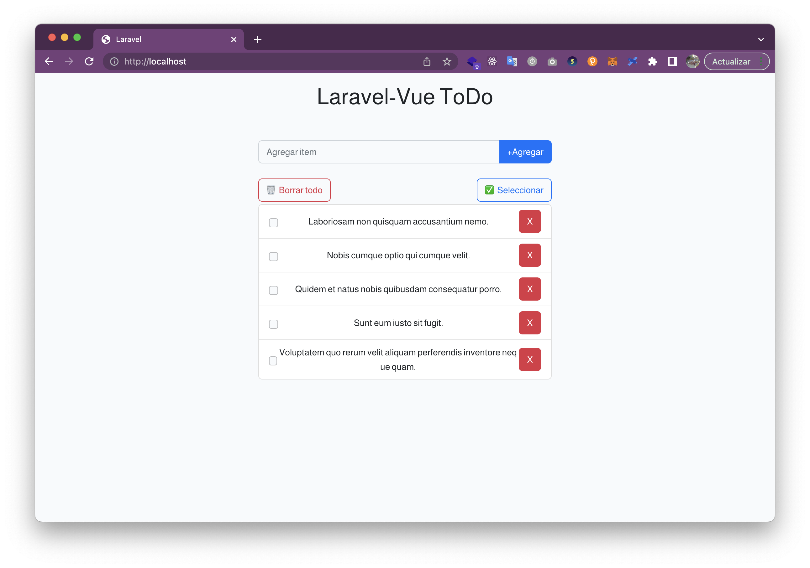
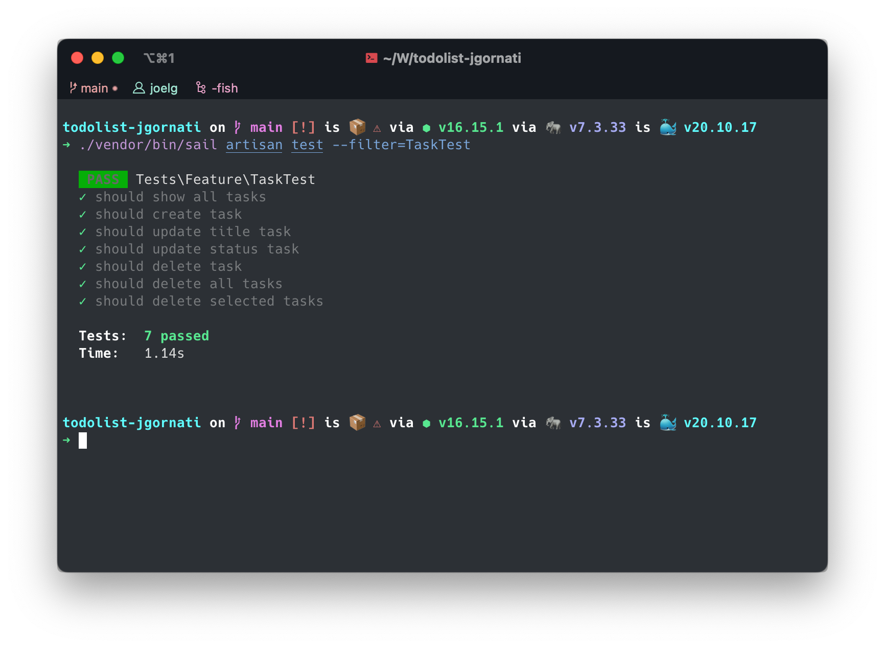

# TODO List

WebApp de tareas hecha con Laravel y Vue


### Setup para desarrollo
Clonar repositorio y acceder
```
$ git clone https://github.com/jgornati/todo-app-jg
$ cd todo-app-jg
```
Instalar dependencias de Laravel
```
$ composer install
```

Copiar .env.example a .env

```
$ cp .env.example .env
```

Correr proyecto con Laravel Sail
```
$ ./vendor/bin/sail up
$ ./vendor/bin/sail php artisan key:generate
$ ./vendor/bin/sail php artisan migrate
$ npm install
$ npm run dev
```

Ejecutar Tests

```
$  ./vendor/bin/sail artisan test --filter=TaskTest
```


Pendientes

- [ ] Hacer validaciones
- [X] Mejorar responsive
- [ ] Hacer loaders

